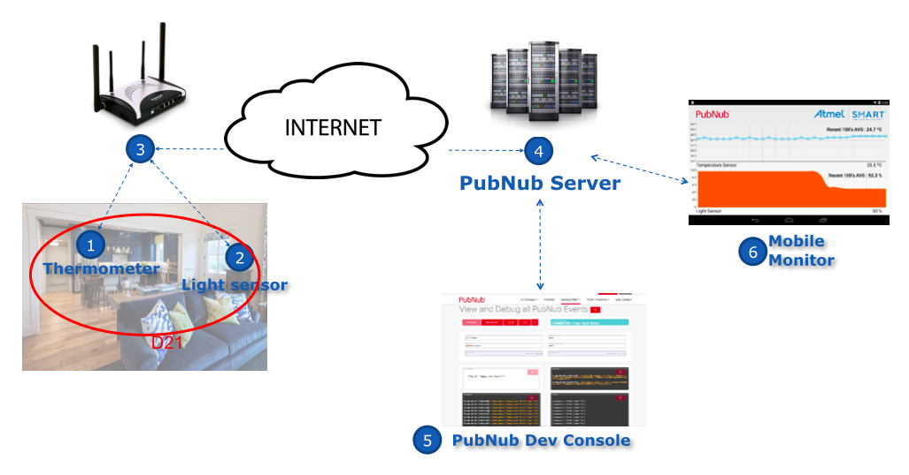
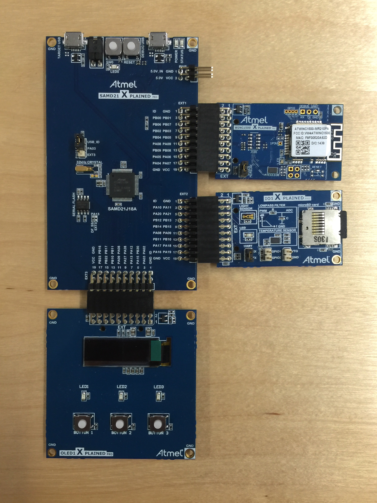
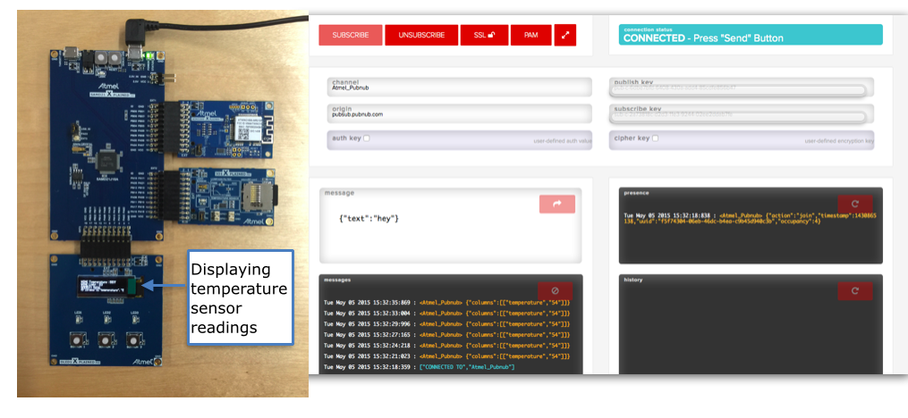

##Blog, How - To


In this blog, I will show you how to build a sophisticated but simple real time temperature and light sensor. Think of the possibilities; a weather reporter, a smart temperature monitor for your nursery or even your wine cellar.   

For a while now, every time I think of IoT, I instantly think of the Raspberry Pi and Arduino. To be honest, when I knew I had to work with an Atmel chip, I was nervous. If only I knew it wont take me more than a couple hours. Yes, its that easy, and I am going to teach you exactly how to build a smart temperature sensor.
 
 
 <insert image of the UI built by Tomomi>
 
 
### What you are building



1. The Atmel I/O1 Xplained Pro contains the temperature and light sensor. 
2. This is connecting to the wifi using the ATWINC1500 module which can talk to any device on the internet.
4. The PubNub code running on the Atmel chip enables us to publish the temperature and light information in real time to any one subscribing to the same channel.
5. Through the [pubnub developer console](http://www.pubnub.com/console/), you can receive this stream of information from as many sensors as you like in real time. 
 

### what you will need
**hardware**
	
1. Atmel ATWINC1500 module mounted on ATWINC1500 Xplained Pro Extension
2. ATSAMD21-XPRO host MCU board for driving the ATWINC1500 Xplained Pro Extension
3. Atmel I/O1 Xplained Pro for sensor and SD-card input to host MCU
	
	

**software**

1. Windows PC.
2. Sign up for [PubNub](https://www.pubnub.com), and get a set of publish and subscribe keys. 
3. Install Atmel Studio 6.2
4. Install updates to Atmel Studio as suggested during installation 
5. Install terminal software like putty or teraterm (I have used putty)
6. Download the files from INSERT LINK TO DROPBOX HERE.
7. Open the PubNub example solution file. 
	

### Connecting the hardware to make sense

1. Connect WINC1500 XPRO board to SAMD21 XPRO connector EXT1
2. Connect IO1 XPRO board to SAMD21 XPRO connector EXT2
3. Connect OLED1 XPRO board to SAMD21 XPRO connector EXT3
4. Connect SAMD21 XPRO to a free USB port on your PC (make sure no other USB port on your PC is in use)
5. Connect the power to the port that says “DEBUG USB”. 
	
	
	
	
### The Software (need to add images)

1. First, we will need to do a firmware update - details on firmware update. 
2. open main.h and change the following : 
	
```#define TEST_MODE_SSID	(choose THE wifi access point you want the chip to connect to)
   #define TEST_MODE_PASSWORD (enter the password for the same wifi connection)
   #define TEST_MODE_WITHOUT_PROVISION
```
3. In main.c, add the channel name and pub, sub keys. 
4. Build (F7 / Build -> build solution), run(continue/ green arrow/ F5/ debug -> continue).
5. Open [PubNub console] (http://www.pubnub.com/console/), use the same channel name and pub,sub keys as in the code and SUBSCRIBE. 
6. If all is well, you should see a constant stream of messages in the following format : 
	<Atmel_Pubnub> {"columns":[["temperature","55"]]}
	
	


5. how to scale this
6. practical use cases


http://www.atmel.com/devices/atwinc1500.aspx?tab=documents - documentation for the hardware